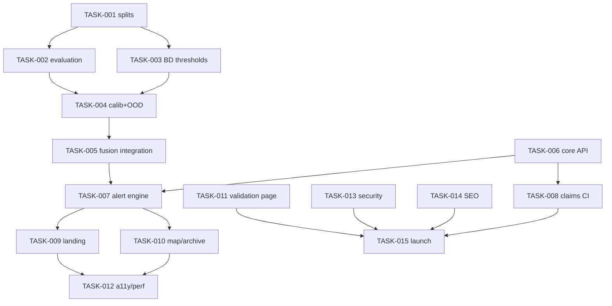

# PRD: HazardNet — Bangladesh Multi-Hazard Early-Warning & Emergency Support Platform v3.0

Generated: 2026-09-17
Version: 3.0
Companion documents: `HazardNet_Deployment_Plan_v3.md` (phased roadmap, incl. v3.1 errata), `trd_hazardnet_v3_20260917.md` (testing blueprint), `task_assignments_20260917.md` (sub-agent delegation file)

---

## Table of Contents

1. Source Reference
2. Technical Interpretation
3. Functional Specifications
4. Technical Requirements & Constraints
5. User Stories with Acceptance Criteria
6. Task Breakdown Structure
7. Dependencies & Integration Points
8. Risk Assessment & Mitigation
9. Testing & Validation Requirements
10. Monitoring & Observability
11. Success Metrics & Definition of Done
12. Technical Debt & Future Considerations
13. Appendices

---

## 1. Source Reference

- **Initiative**: HazardNet live deployment — integration of leakage-safe evaluation (measured: event-KFold 0.9887 vs temporal 0.109), Bangladesh-calibrated severity thresholds, fusion inference with OOD guard, and institutional-grade web presence.
- **Repository (destination)**: `github.com/myself-aas/HazardNet`, branch `arena/01a0adae-hazardnet` — NOT a verified source; see Integration Status in the deployment plan.
- **Inputs verified this engagement**: training notebook (`hazardnet-experimental-training-pipeline`), evaluation CSVs (`cross_strategy_comparison.csv`, `event_kfold_results.csv`, `spatial_lodo_results.csv`).
- **Original product story**: "Multi-hazard AI forecasting for Bangladesh agriculture / decision support — CNN trained on 2,931 historical hazard events (2000–2026), 8 classes."
- **Business acceptance criteria (from audits)**: provenance-layer website (GFDRR/UNDRR/NASA benchmarks); no unverifiable public numbers; human-reviewed alerts; BMD/FFWC/DDM authority boundary; Bengali + English; advisory-first positioning until the deployment gate passes.

---

## 2. Technical Interpretation

| Business requirement | Technical implementation |
| --- | --- |
| "Early warning for Bangladesh" | 8-class CNN (Cold Wave, Drought, Fire, Flash Flood, Flood, Heat Wave, Severe Local Storm, Tropical Cyclone) over 15-channel × 10-timestep tensors; severity head regresses physically anchored [0,1] severity |
| "Trustworthy alerts" | Isotonic calibration (recent-era only) → OOD-gated trust → trust-weighted geometric fusion with BD physics tracks → conformal prediction sets → human-in-the-loop publishing |
| "Credible to institutions" | Leakage-safe evaluation (grouped K-fold + rolling-origin), tier verification (POD/FAR at BMD/FFWC/EFFIS/WMO thresholds), published monthly metrics, DOI-traceable methodology |
| "Usable in emergencies" | Bengali/English, low-bandwidth lite mode, district-level outputs aligned to BBS boundaries (64 districts), SMS/email subscription, WCAG 2.2 AA |
| "Honest about limits" | Claims registry (`CLAIMS.md`), deployment gate (rolling-origin macro-F1 ≥ 0.5 AND POD ≥ 0.7 severe tier), "uncertain" state rendered instead of overconfident labels |

**Screenshot/analysis basis**: current hazardnet.live = single-screen system monitor (readouts: latency, softmax %, tile counts). Replaced by benchmark landing pattern (NASA layout): one hero alert → status strip → dated alert cards → hazard-topic browse → subscribe.

---

## 3. Functional Specifications

### 3.1 Core Requirements

**REQ-001 — Leakage-safe evaluation (P0)**

- Description: All published model metrics must derive from `grouped_kfold` (place-season groups + temporal embargo) and/or `rolling_origin` (forward-chaining with checkpoint init). Legacy random splits retained only as labeled leaky baselines.
- Edge cases: event IDs duplicated across folds (guard must fire); single-year origins with <20 test events (skip with log); missing date column (year-parse fallback with warning).
- Error scenarios: `assert_disjoint_groups` failure → hard stop; `assert_temporal_order` failure → hard stop.

**REQ-002 — Bangladesh-anchored severity (P0)**

- Description: Severity targets normalized via `SEVERITY_THRESHOLDS_BD` (Tmin 16/13/10/8/6°C; Tmax 36/38/40/42°C; FFWC danger-level offsets −0.5/0/+1/+2 m; 24-h rain 44/88/150/250 mm; SPEI −1/−1.5/−2; FWI 11.2/21.3/38/50; gusts 45/61/91/121/150 km/h; NIO winds 63/89/118/166/221 km/h).
- Edge cases: decreasing-direction indices (Tmin, SPEI) handled in deficit space; tier severities must exist exactly in anchors.
- Error scenarios: 57/57 `validate_bd_thresholds()` proofs failing → block training run.

**REQ-003 — Trustworthy inference (P0)**

- Description: Every inference emits `{probabilities, top_hazard, alert_level, uncertain, cnn_trust, prediction_set, rationale, severity}`; OOD input → physics-led or `uncertain`; conformal set size > 1 → `uncertain`.
- Edge cases: all physics inputs missing → CNN-only with trust gate; tropical cyclone (no physics track) → CNN-only, never auto-escalate without human review.
- Error scenarios: fusion bundle version mismatch with model checkpoint → API refuses to start.

**REQ-004 — Human-reviewed alerting (P0)**

- Description: State machine `DRAFT → PENDING_REVIEW → PUBLISHED → UPDATED → EXPIRED/ALL_CLEAR` (+`REJECTED` with reason feeding labels). Publishing requires `alert.review` role at API level.
- Edge cases: reviewer rejects → reason captured as ground-truth label; alert updated while published → versioned update, public timeline preserved.
- Error scenarios: unauthenticated publish attempt → 403 + audit event.

**REQ-005 — Provenance-first public surface (P0)**

- Description: Landing page (NASA layout, BD content) with live status strip, permalinked alert archive, district risk map (64 districts, BD tier colors), methodology/data/model-card pages, authority-boundary banner, বাংলা/EN toggle, subscribe CTA.
- Edge cases: no active alert → hero shows latest analysis; stale data (>6h) → freshness badge shows age, color shifts.
- Error scenarios: API down → static cached bulletin page served (graceful degradation).

**REQ-006 — Claims registry (P0)**

- Description: `CLAIMS.md` maps every public number → evaluation strategy label. Site build fails CI if a metric appears without a matching registry entry.

**REQ-007 — District hazard archive (P1)**

- Description: 2,931 events geocoded to BBS boundaries with per-district risk profiles and permalinks; powers SEO and the historical-prior display layer.

**REQ-008 — Subscription & notification (P1)**

- Description: District-level SMS/email signup; SMS via BD aggregator; alert publication triggers dispatch.
- Edge cases: subscription for district with no coverage → confirmation with expectation-setting; delivery failure → retry + status page incident.

**REQ-009 — Operational transparency (P1)**

- Description: `/validation` page publishes monthly POD/FAR/CSI per division and tier; `status.hazardnet.live` shows uptime + per-source data freshness.

**REQ-010 — Feedback loop (P1)**

- Description: Public "report what you see" per alert → ingested as labeled ground truth → quarterly retraining input.

### 3.2 Out of Scope (v3.0)

Landslide, riverbank erosion, urban waterlogging, storm surge (no model classes); new dataset downloads; auto-published public alerts; SAR/optical ingestion beyond existing archive; native mobile app.

### 3.3 Business Rules

- Alert tiers derive ONLY from `SEVERITY_THRESHOLDS_BD` tiers (watch/warning/severe); tuning restricted to rolling-origin validation years, then frozen + versioned.
- Public wording rule: every alert page shows official-sources block (BMD/FFWC/DDM) and model/fusion versions.
- Claims rule: rolling-origin macro-F1 < 0.5 → site wording "experimental / decision-support," alerting disabled.

---

## 4. Technical Requirements & Constraints

### 4.1 System Architecture

```javascript
┌────────────────────────────────────────────────────────────┐
│ CLIENT: Next.js PWA (bn/en) — hero alert, status strip,    │
│ district map (MapLibre), alert archive, /validation        │
└──────────────┬─────────────────────────────────────────────┘
               │ HTTPS/JSON
┌──────────────▼─────────────────────────────────────────────┐
│ API GATEWAY: FastAPI — auth(JWT+RBAC), rate limit,         │
│ /alerts /predict /regions /reports /feedback /bulletins    │
└──────┬──────────────────────┬──────────────────────┬───────┘
       │                      │                      │
┌──────▼───────┐   ┌──────────▼─────────┐   ┌────────▼────────┐
│ Core DB      │   │ Inference worker   │   │ Alert engine    │
│ PG+PostGIS   │   │ hazardnet_fusion   │   │ state machine + │
│ alerts,audit │   │ (calib+OOD+conform)│   │ HITL review     │
└──────┬───────┘   └──────────┬─────────┘   └────────┬────────┘
       │                      │                      │
┌──────▼──────────────────────▼──────────────────────▼───────┐
│ Artifacts: model ckpt + fusion_bundle.joblib + thresholds   │
│ VERSIONED TOGETHER — mismatch => refuse to start            │
└─────────────────────────────────────────────────────────────┘
```

### 4.2 Data Models (key tables)

```sql
hazard_events(id, hazard_type, start_date, end_date, geom, severity_src,
              source, source_url, division, district)         -- 2,931 archive
alerts(id, district, hazard, tier, fused_prob, calib_prob, cnn_trust,
       prediction_set, uncertain, rationale, model_ver, fusion_ver,
       issued_at, valid_until, state, reviewer_id, reject_reason)
alert_history(alert_id, ts, from_state, to_state, actor, note) -- audit
subscriptions(id, channel, target, district, lang, active)
feedback(id, alert_id, ts, reporter, observation, status)      -- GT labels
predictions(id, alert_id, input_lineage jsonb, created_at)     -- lineage
```

### 4.3 API Contracts (excerpt — full contract in deployment plan Phase 6)

```yaml
POST /v1/alerts/{id}/review
  auth: role=reviewer
  body: {action: approve|reject|escalate, reason?: string}
  200: {alert_id, state, updated_at}
  403: {error: REVIEW_ROLE_REQUIRED}
  409: {error: INVALID_STATE_TRANSITION}

GET /v1/alerts?district=&level=
  200: [{id, district, hazard, tier, issued_at, valid_until, state:PUBLISHED}]

POST /v1/feedback
  body: {alert_id?, district, observation, lang}
  201: {feedback_id, status: queued_for_labeling}
```

### 4.4 Performance Requirements

- Landing LCP < 2.5s on Bangladesh 3G; lite mode < 50KB; map lazy-loaded.
- Alert list API p95 < 300ms; alert publish path (incl. dispatch trigger) < 5s.
- Inference batch: 64-district scan < 10 min on 1×T4 (existing v1.0 throughput as bound).

### 4.5 Security Requirements

- RBAC: public/analyst/reviewer/admin; reviewer TOTP optional; JWT short-lived + rotation.
- CSP without `unsafe-inline`; HSTS; CORS allowlist; rate limiting; secrets via env/Vault (never in repo); `security.txt`.
- All mutating endpoints audited (user, ts, before/after).

### 4.6 Constraints

- **No new dataset downloads** (time/resource): existing `master_tensors.h5` + archive only; optional free APIs (Open-Meteo) later.
- Kaggle T4 for training/eval; single-VPS staging first.
- Bengali parity: every public string has bn + en; disaster terminology reviewed by native speaker.

---

## 5. User Stories with Acceptance Criteria

**USR-001 — Resident checks current risk (P0)**
As a resident of Sunamganj, I want to see today's alert for my district in Bengali within 3 taps, so that I can decide on precautions.

- [ ] Landing shows district-relevant alert strip above the fold
- [ ] Alert page states: hazard, tier (বাংলা), issued/valid times, what-the-tier-means (BD interpretation string), official sources
- [ ] Works on 3G, lite mode, WCAG AA
- [ ] If `uncertain`, page says "conditions unusual — model confidence low," never a single hazard name

**USR-002 — Duty officer reviews an alert (P0)**
As a HazardNet duty officer, I want drafts to queue for my approval with evidence (fused prob, trust, rationale, prediction set), so that nothing auto-publishes.

- [ ] Queue sorted by severity; each item shows full evidence trail
- [ ] Approve → published with versions stamped; Reject → reason stored, feeds feedback labels
- [ ] Direct publish without reviewer role returns 403 + audit event
- [ ] Concurrent review of same alert → optimistic locking, second actor warned

**USR-003 — DDM/NGO partner assesses credibility (P0)**
As a DDM-affiliated reviewer, I want methodology, validation metrics, and data sources in one place, so that I can evaluate partnership.

- [ ] /methodology links model card, threshold table with DOIs, split manifest
- [ ] /validation shows monthly POD/FAR per division (rolling-origin basis labeled)
- [ ] Claims on every page traceable to CLAIMS.md entry

**USR-004 — Researcher uses the archive (P1)**
As a researcher, I want district risk profiles from the 2,931-event archive with citations, so that I can cite HazardNet.

- [ ] Per-district profile page: event timeline 2000–2026, hazard mix, sources
- [ ] `Dataset` structured data; exportable CSV with license + DOI references

**USR-005 — Admin retires a model version (P1)**
As an admin, I want deployments to refuse startup on artifact version mismatch, so that stale models never serve.

- [ ] API boot checks model ckpt ↔ fusion_bundle ↔ thresholds dict ↔ git SHA
- [ ] Mismatch → startup failure with explicit diff report

**USR-006 — Site visitor reports ground truth (P1)**
As a visitor, I can report "flood confirmed/not seen" per alert; report enters labeling queue with my district + timestamp.

---

## 6. Task Breakdown Structure

*Estimates assume 1 ML engineer + 1 web engineer + reviewer availability; Kaggle T4 quota for training.*

#### Phase A — Evidence & Data (Days 1–2)

**TASK-001: Derive split metadata + generate leakage-safe splits**
Type: ML/Data · Effort: 4h · Dependencies: none
Files: `training/hazardnet_splits.py` (exists — run), `data/split_manifest.csv`
Acceptance: manifest shows per-fold counts; both guards pass; `severity_source_index` mapped if legacy severity is physical.

**TASK-002: Honest evaluation runs**
Type: ML · Effort: 3 Kaggle sessions (~6 GPU-h) · Dependencies: TASK-001
Files: results under `results/grouped_kfold/`, `results/rolling_origin/`; `CLAIMS.md` updated
Acceptance: macro-F1 + tier POD/FAR per fold archived; cross-strategy table regenerated.

#### Phase B — Bangladesh Calibration (Day 3)

**TASK-003: Apply + prove BD thresholds**
Type: ML · Effort: 1h CPU · Dependencies: TASK-001
Files: `training/hazardnet_bd_thresholds.py` (exists — integrate), validation log
Acceptance: 57/57 proofs pass; severity targets regenerated.

#### Phase C — Trustworthy Inference (Days 3–5)

**TASK-004: Calibration + OOD + conformal training**
Type: ML · Effort: 4h GPU · Dependencies: TASK-002
Files: `inference/fusion_bundle.joblib`, calibration report (ECE before/after)
Acceptance: ECE reduced vs raw; OOD synthetic inputs → `uncertain` verified.

**TASK-005: Fusion scorer integration test**
Type: ML/Backend · Effort: 6h · Dependencies: TASK-004
Acceptance: full output contract per REQ-003; version-mismatch refusal test passes.

#### Phase D — Backend & Alert Engine (Days 5–9)

**TASK-006: Core API + PostGIS schema** (16h) — migrations, RBAC, audit.
**TASK-007: Alert state machine + review console endpoints** (12h) — REQ-004.
**TASK-008: Claims registry CI check** (4h) — REQ-006 blocks deploy on unregistered metrics.

#### Phase E — Frontend (Days 7–13, parallel)

**TASK-009: Landing rebuild (NASA layout, BD content, bn/en)** (20h) — REQ-005.
**TASK-010: District map + alert archive pages** (16h).
**TASK-011: /validation + status page** (8h).
**TASK-012: Accessibility + performance pass** (8h) — Lighthouse a11y ≥ 95, LCP budget.

#### Phase F — Hardening & Launch (Days 13–17)

**TASK-013: Security P0 checklist** (8h) — headers, CORS, rate limits, secrets, security.txt.
**TASK-014: SEO foundations + structured data** (6h) — sitemap/robots fix, Dataset/Org schema.
**TASK-015: Hindcast + tabletop + soft launch** (12h) — out-of-fold years only (v3.1 errata #2); DDM-adjacent reviewers; advisory beta.

#### Dependency Graph



#### Critical Path

`TASK-001 → TASK-002 → TASK-004 → TASK-005 → TASK-007 → TASK-009 → TASK-012 → TASK-015` ≈ 2h + 6GPU-h + 4h + 6h + 12h + 20h + 8h + 12h ≈ **~9 working days** (parallelizable to calendar Day 15–17 with two engineers).

---

## 7. Dependencies & Integration Points

- **Internal**: Kaggle dataset mount (`master_tensors.h5`), `dataset_config.json` (n_classes, hazard_types) — verify per Integration Status section of deployment plan.
- **External (optional, no-download path)**: Open-Meteo forecast API (physics-track inputs); BMD/FFWC bulletins (manual mirror acceptable at beta); SMS aggregator (SSL Wireless/Infobip BD) for USR-008.
- **Version coupling**: model ckpt ↔ fusion_bundle ↔ thresholds ↔ git SHA (REQ-005, USR-005).

---

## 8. Risk Assessment & Mitigation

| Risk | Prob. | Impact | Mitigation |
| --- | --- | --- | --- |
| Rolling-origin macro-F1 < 0.5 | Medium | High | Advisory-only wording pre-approved; recency-weighted retrain procedure (deployment plan Phase 3 step 4); physics-led display under OOD |
| Monsoon cloud cover degrades optical inputs | High (seasonal) | High | OOD guard → physics tracks lead; site shows freshness badge |
| False public alert | Low (gated) | Critical | HITL + conformal uncertain state + claims freeze |
| Repo integration assumptions wrong | Medium | Medium | Integration Status checklist (5×5-min verifications) before Phase C |
| Bengali terminology errors | Medium | Medium | Native-speaker review of tier strings before launch |
| Hindcast circularity | Medium | High | v3.1 errata #2 enforced in TASK-015 acceptance criteria |

---

## 9. Testing & Validation Requirements

Testing-first details live in the **TRD** (`trd_hazardnet_v3_20260917.md`). Summary of gates:

- **Unit**: normalizer monotonicity + round-trip; guard assertions; tier ordering; calibration ECE math.
- **Integration**: split generation guards; fusion contract; alert state machine; RBAC; version-mismatch refusal; API contracts.
- **E2E**: landing render with live alerts; full publish flow (draft→review→published→public page); uncertain-state rendering; bn/en parity; 3G performance budget.
- **Operational verification**: POD/FAR harness on rolling-origin folds; drift watch.

---

## 10. Monitoring & Observability

- **Business metrics**: alerts published by tier/division; POD/FAR monthly; subscription growth; feedback labels ingested.
- **Model metrics**: ECE on recent era; conformal set-size distribution; OOD trigger rate; trust distribution drift (PSI).
- **System metrics**: API latency, queue depth, ingestion freshness per source, uptime.
- **Alerting rules**: OOD rate > 20% over 6h; set-size mean > 1.5; publish-path failure; freshness > 6h for any active layer.
- **Transparency surfaces**: `status.hazardnet.live`, `/validation`, public FAR.

---

## 11. Success Metrics & Definition of Done

**Pre-registered deployment gate:** rolling-origin macro-F1 ≥ 0.5 AND POD ≥ 0.7 (severe tier) → alerting enabled; below gate → advisory beta with "experimental" wording.

**Definition of Done (v3.0 launch)**

- [ ] 57/57 BD threshold proofs pass in CI
- [ ] Rolling-origin results archived + CLAIMS.md updated; gate decision recorded
- [ ] Fusion bundle verified (ECE improved; OOD→uncertain demonstrated)
- [ ] Alert engine E2E with HITL enforcement (403 test evidence)
- [ ] Landing rebuilt to NASA-layout spec; Lighthouse a11y ≥ 95; LCP budget met
- [ ] bn/en parity on all public strings
- [ ] Security P0 checklist green; security.txt live
- [ ] sitemap/robots fixed; structured data validated
- [ ] status + /validation pages publishing real data
- [ ] Hindcast (out-of-fold only) + tabletop report filed
- [ ] Runbook + rollback procedure written

---

## 12. Technical Debt & Future Considerations

- Landslide/erosion/waterlogging classes (require new data — deferred by constraint).
- Sentinel-1 SAR for monsoon optical blindness; ERA5/GSMaP ingestion (deferred downloads).
- MLflow registry (current: versioned artifacts + manifest — sufficient at this scale).
- Champion/challenger promotion pipeline; quarterly retrain automation.
- DDM/FFWC API integration when partnerships formalize.

---

## 13. Appendices

### 13.1 Glossary

**POD** probability of detection · **FAR** false alarm ratio · **CSI** critical success index · **ECE** expected calibration error · **OOD** out-of-distribution · **HITL** human-in-the-loop · **APS** adaptive prediction sets · **FFWC** Flood Forecasting & Warning Centre · **BMD** Bangladesh Meteorological Department · **DDM** Department of Disaster Management · **NIO** North Indian Ocean cyclone scale.

### 13.2 References (validated 2026-09-17)

TC: 10.1016/j.tcrr.2023.06.002 · 10.1016/j.jweia.2022.105026 · 10.1007/s44274-025-00450-0 · 10.3389/feart.2025.1615811 · 10.1007/s43762-023-00113-x · 10.1029/2024JH000206
Flood/flash: 10.1111/jfr3.12959 · FFWC definitions · BMD rain classes · arXiv:2605.20167
Drought: 10.1038/s41598-022-24146-0 · PMC10767098
Heat/cold: 10.1175/WAF-D-24-0129.1 · 10.3390/app13127030 · PMC11111018 · FOREWARN 2022
Fire: 10.1088/1748-9326/ad97cf
Storms: 10.1029/2024GL110960 · 10.1175/BAMS-D-21-0260.1 · Hoque 2022 (BanglaJol 29(1))
**Rejected:** 10.1038/s43247 (incomplete DOI).

### 13.3 Change Log

- **3.0.1 (2026-09-17, agent execution):** file inventory corrected to repo
  reality — the v3 modules and docs were delivered at the repo root, not under
  `training/` + `docs/`; they now live at `training/hazardnet_scientific_pipeline.py`,
  `training/hazardnet_bd_thresholds.py`, and `docs/{PRD,TRD,TASKS,
  HazardNet_Deployment_Plan_v3}.md` (renamed from their dated uploads; no
  external references existed). `hazardnet_splits.py` / `inference/fusion.py`
  are not separate files: the pipeline module embeds the split generators and
  fusion components (packaging difference only). Full verification record:
  `docs/RUNBOOK_LOG.md`.

| Version | Date | Author | Changes |
| --- | --- | --- | --- |
| 3.0 | 2026-09-17 | Planning agent (Kimi) | Initial PRD integrating leakage-safe evaluation, BD thresholds, fusion inference, benchmark-anchored frontend |