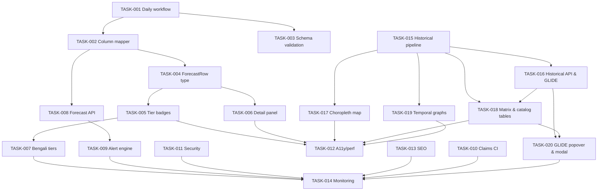

# PRD: HazardNet — Bangladesh Multi-Hazard Early-Warning & Emergency Support Platform

Version: 4.1 · Updated: 2026-09-29
Companion documents: `TRD.md` (testing & quality), `PUBLICATION_POLICY.md`

---

## Table of Contents

1. Product Overview
2. What Is Public
3. Functional Specifications
4. Daily Automation Pipeline
5. Technical Requirements & Constraints
6. User Stories with Acceptance Criteria
7. Task Breakdown Structure
8. Dependencies & Integration Points
9. Risk Assessment & Mitigation
10. Testing & Validation Requirements
11. Monitoring & Observability
12. Success Metrics & Definition of Done
13. Technical Debt & Future Considerations
14. Appendices

---

## 1. Product Overview

- **Product**: HazardNet — a multi-hazard early-warning and decision-support
  platform for Bangladesh agriculture.
- **Live site**: https://www.hazardnet.live
- **Coverage**: all 64 districts of Bangladesh, 8 divisions.
- **Hazard classes**: Cold Wave, Drought, Fire, Flash Flood, Flood, Heat Wave,
  Severe Local Storm, Tropical Cyclone (8 total).
- **Forecast horizons**: 7-day and 15-day outlooks.
- **Output per district per horizon**: hazard class, advisory tier
  (SEVERE / WARNING / WATCH / NORMAL), severity score, confidence, and
  forecasted weather conditions.
- **Update cadence**: daily, automated via Kaggle notebook + GitHub Actions.
- **Academic context**: Master's thesis project, Department of Agrometeorology,
  Bangladesh Agricultural University. Not an official warning service — official
  warnings come from BMD and FFWC. For emergencies, call 999.

---

## 2. What Is Public

This repository and the website publish **results and outputs only**
(see `PUBLICATION_POLICY.md` for the binding policy):

| Public | Research-private (not published) |
| --- | --- |
| Published forecast records (district, hazard, severity, confidence, horizons) | Model code, architecture, implementation |
| Advisory tier levels and run reports | Dataset collection procedures, source composition |
| Historical hazard datasets (2000–2026), district vulnerability indices, temporal trend reports, GLIDE cross-references | Training pipelines, experiment records, hyperparameters |
| Validation scorecard headline counts (with stated limitations) | Evaluation methodology, benchmark sweeps |
| Freshness / provenance record behind every number | Severity derivation logic, threshold calibration |
| Web application code that presents results, tables, and interactive graphs | Internal scoring, calibration, or fusion processes |
| Daily pipeline orchestration (fetch, validate, publish) | Proprietary neural feature weights or embeddings |

**Standing rule**: no PRD requirement, user story, or task may reference or
require research-private material to be published.

---

## 3. Functional Specifications

### 3.1 Core Requirements

**REQ-001 — Automated daily forecast publishing (P0)**

- Description: the system publishes a fresh set of 128 forecast records
  (64 districts × 2 horizons) daily with zero human intervention.
- Source: Kaggle notebook `8-hazardnet-advisory` runs on schedule, produces
  `hazardnet_advisories_latest.csv`.
- GitHub Actions fetches the output, validates schema, maps columns to the
  backend schema, ingests into the forecast store, and deploys.
- Edge cases: Kaggle notebook fails → retry once, then alert ops; CSV stale
  (>36h) → ingestion halts, previous data preserved.
- Error scenarios: CSV has missing columns → schema validation fails-fast;
  zero rows → ingestion aborts.

**REQ-002 — Human-reviewed alerting (P0)**

- Description: state machine
  `DRAFT → PENDING_REVIEW → PUBLISHED → UPDATED → EXPIRED/ALL_CLEAR`
  (+ `REJECTED` with reason). Publishing requires `alert.review` role at API
  level.
- Edge cases: reviewer rejects → reason captured; alert updated while
  published → versioned update, public timeline preserved.
- Error scenarios: unauthenticated publish attempt → 403 + audit event.

**REQ-003 — Provenance-first public surface (P0)**

- Description: landing page with live status strip, permalinked alert archive,
  district risk map (64 districts), authority-boundary banner, বাংলা/EN toggle,
  subscribe CTA.
- Every alert page shows: hazard, advisory tier, issued/valid times,
  tier meaning, official sources (BMD/FFWC/DDM), and model/fusion versions.
- Edge cases: no active alert → hero shows latest analysis; stale data (>36h)
  → freshness badge shifts colour.
- Error scenarios: API down → static cached snapshot served (graceful
  degradation).

**REQ-004 — Advisory tier display (P0)**

- Description: every published forecast record includes an `advisory_tier`
  (SEVERE / WARNING / WATCH / NORMAL) and displays it with colour-coded
  badges, map markers, and accessible labels.
- Each forecast also carries:
  - Fused severity score (`final_severity`)
  - Classification confidence
  - Physics override indicator
  - Forecasted weather conditions (temperature, precipitation, wind)
- See TRD §2.1 for the full output schema.

**REQ-005 — Claims registry (P0)**

- Description: `CLAIMS.md` maps every public number → its stated limitations.
  Site build fails CI if a metric appears without a matching registry entry.

**REQ-006 — Historical Hazard Archive, Multi-Scale Scientific Mapping & GLIDE Provenance (P0)**

- Description: HazardNet integrates a comprehensive 26-year historical disaster
  intelligence catalog (2000–2026) derived from notebook `1-HazardNet_BGD_climatic_hazards`,
  synthesizing 3,062 clean deduplicated meteorological events, 70 aggregated master
  disaster events with official GLIDE identifiers, and complete multi-hazard
  vulnerability rankings across all 64 districts.
- Multi-Scale Spatial Hierarchy:
  - **District Level (64 districts)**: Composite Vulnerability Index scores
    (ranging 0.0 to 1.0, e.g., Bandarban/Cox's Bazar 0.992, Bhola/Lalmonirhat 0.961,
    Jamalpur/Kurigram/Sirajganj 0.898), total event frequency, unique hazard diversity
    (up to 10 distinct hazard types), and permalinked district risk profiles (`/district/[id]`).
  - **Division Level (8 divisions)**: Geospatial aggregation linking regional
    climatological vulnerability profiles — coastal cyclone corridors (Barishal,
    Chattogram), Haor wetland flash-flood basins (Sylhet, Mymensingh), Jamuna/Padma
    riverine flood plains (Rangpur, Rajshahi, Dhaka), and northern cold-wave zones.
  - **National Level**: 26-year temporal trajectory (2000–2026) capturing annual
    event frequencies, severe landmark disaster years (2007 Cyclone Sidr, 2009 Cyclone
    Aila, 2017 Floods, 2024 Cyclone Remal/Floods), and multi-hazard distribution across
    8 classes (Flood 29.1%, Tropical Cyclone 23.2%, Severe Local Storm 16.8%, Flash
    Flood 10.9%, Cold Wave 10.5%, Fire 2.1%, Drought 2.1%, Heat Wave 1.2%).
- Global GLIDE ID Integration & Multilateral Provenance:
  - Every major disaster record preserves its globally unique GLIDE number
    (`[Hazard Code]-[Year]-[Serial]-[Country]`, e.g., `FL-2026-000109-BGD`, `TC-2024-000067-BGD`).
  - Interactive outbound resolution to authoritative international agencies:
    - **UN OCHA ReliefWeb**: Direct situation reports, humanitarian updates, and funding appeals
      (`https://reliefweb.int/disaster/{GLIDE}`).
    - **FAO (Food and Agriculture Organization)**: Crop and food security assessments,
      agricultural loss dossiers, and GIEWS country briefs (`https://www.fao.org/giews/countrybrief/country.jsp?code=BGD`).
    - **WHO (World Health Organization)**: Disease Outbreak News (DON), post-disaster
      epidemic monitoring, and public health emergency surveillance (`https://extranet.who.int/public-emergencies`).
    - **ADRC (Asian Disaster Reduction Center)**: Master GLIDE Registry entries
      (`https://www.glidenumber.net/glide/public/search/search.jsp?glide={GLIDE}`).
    - **IFRC GO**: Emergency appeals, DREF operations, and field assessment reports
      (`https://go.ifrc.org/emergencies?search={GLIDE}`).
- Interactive Frontend Components & Tables:
  - **District Vulnerability Matrix Table (`<DistrictVulnerabilityTable />`)**:
    Sortable and filterable by division, rank, total events, unique hazards, and
    composite vulnerability score with visual progress meters and search.
  - **Historical Hazard Catalog Table (`<HistoricalHazardCatalog />`)**:
    Searchable by GLIDE ID, district, hazard type, and year range (2000–2026);
    features clickable GLIDE badges opening institutional links and situation summaries.
  - **Interactive Choropleth Risk Map (`<DistrictRiskMap />`)**:
    Choropleth layer rendering 64 districts color-coded by vulnerability index,
    interactive hover tooltips, and click-to-open drawer showing historical profile.
  - **Temporal Trends Interactive Graph (`<TemporalTrendChart />`)**:
    Dynamic Recharts/Chart.js bar and line graph illustrating yearly disaster frequencies
    (2000–2026) with landmark disaster event annotations.
  - **Multi-Hazard Distribution Graph (`<MultiHazardDistributionChart />`)**:
    Interactive radial/donut/bar chart breaking down proportional hazard occurrences
    nationally and filtered by administrative division.
  - **Event Situation Report Modal (`<EventReportModal />`)**:
    Detail dialog featuring narrative situation descriptions, validated affected counts,
    GEE temporal observation windows (`GEE_Start` to `GEE_End`), district footprints,
    and direct branded links to FAO, WHO, ReliefWeb, and ADRC.
- Surface Placements:
  - Landing page (`/`): Headline historical counters (3,062 events, 64 districts, 26 years)
    and embedded interactive choropleth risk map.
  - Archive / Hazard Explorer (`/archive` or `/hazards`): Full searchable catalog table,
    multi-hazard filters, and CSV/JSON export capability.
  - District Risk Profile (`/district/[id]`): District-specific historical timeline,
    vulnerability ranking, and hazard radar breakdown.
  - Analytics & Reports (`/reports` or `/analytics`): National & divisional temporal trends
    and GLIDE institutional reference cross-walk.
  - Validation Page (`/validation`): Historical ground truth baselines and verified disaster
    event counts.

**REQ-007 — Subscription & notification (P1)**

- Description: district-level SMS/email signup; alert publication triggers
  dispatch.
- Edge cases: subscription for district with no coverage → confirmation with
  expectation-setting; delivery failure → retry + status page incident.

**REQ-008 — Operational transparency (P1)**

- Description: `/validation` page publishes headline verification counts per
  division with their stated limitations; `status.hazardnet.live` shows uptime
  + per-source data freshness.

**REQ-009 — Feedback loop (P1)**

- Description: public "report what you see" per alert → ingested as labeled
  ground truth.

**REQ-010 — Daily automation (P0)**

- Description: the entire pipeline from Kaggle notebook output to frontend
  deployment runs daily via GitHub Actions without human intervention.
  See §4 for full architecture.

### 3.2 Out of Scope (v4.0)

- Landslide, riverbank erosion, urban waterlogging, storm surge (no model
  classes)
- New dataset downloads beyond existing archive
- Auto-published public alerts (HITL review remains mandatory)
- Native mobile app
- Additional satellite data ingestion

### 3.3 Business Rules

- Advisory tiers (SEVERE/WARNING/WATCH/NORMAL) are computed by the Kaggle
  notebook and published as-is; the backend does not re-derive them.
- Public wording rule: every alert page shows official-sources block
  (BMD/FFWC/DDM) and model/fusion versions.
- Claims rule: if the deployment gate has not been met → site wording shows
  "experimental / decision-support," alerting flagged as advisory.

---

## 4. Daily Automation Pipeline

### 4.1 Pipeline Architecture

```
┌──────────────────────────────────────────────────────────────────────┐
│                        DAILY PIPELINE FLOW                          │
│                                                                      │
│  Kaggle Notebook (8-hazardnet-advisory)                             │
│       ↓  auto-run daily (Kaggle scheduling)                         │
│  hazardnet_advisories_latest.csv                                    │
│       ↓  output artifact (64 districts × 2 horizons = 128 rows)    │
│                                                                      │
│  GitHub Actions (daily_advisory_ingest.yml)                         │
│       ├─ Fetch CSV from Kaggle output                               │
│       ├─ Validate schema + staleness (< 36h)                        │
│       ├─ Map advisory columns → backend ForecastRow schema          │
│       ├─ Write to backend/data/forecasts/ + manifest.json           │
│       ├─ Build static snapshot (forecasts-latest.json)              │
│       ├─ Ingest into Firestore forecast store                       │
│       └─ Deploy frontend bundle (Vercel)                            │
│                                                                      │
│  Frontend (Live)                                                     │
│       ├─ Firestore real-time listener (primary data source)         │
│       └─ Static snapshot fallback (offline/degraded mode)           │
└──────────────────────────────────────────────────────────────────────┘
```

### 4.2 Kaggle Advisory Output Schema

The Kaggle notebook produces 22 columns per row:

| Column | Type | Description |
| --- | --- | --- |
| `district` | string | District name (64 districts) |
| `division` | string | Parent division (8 divisions) |
| `latitude` | float | District centroid |
| `longitude` | float | District centroid |
| `horizon` | enum | `7_days` or `15_days` |
| `hazard` | enum | One of 8 hazard classes |
| `confidence` | float [0,1] | Classification confidence |
| `cnn_severity_raw` | float [0,1] | Raw uncalibrated severity |
| `cnn_severity` | float [0,1] | Calibrated severity |
| `physics_severity` | float [0,1] | Physics-track severity |
| `final_severity` | float [0,1] | Fused final severity |
| `physics_override` | boolean | Whether physics overrode the model |
| `advisory_tier` | enum | SEVERE / WARNING / WATCH / NORMAL |
| `target_date` | ISO date | Forecast valid-for date |
| `generated_at` | ISO datetime | Pipeline execution timestamp |
| `om_max_temp_c` | float | Forecasted max temperature (°C) |
| `om_min_temp_c` | float | Forecasted min temperature (°C) |
| `om_precip_mm` | float | Forecasted precipitation (mm) |
| `om_wind_kmh` | float | Forecasted max wind speed (km/h) |
| `prob_top1` | float [0,1] | Top-1 class probability |
| `prob_top2` | float [0,1] | Top-2 class probability |
| `prob_top3` | float [0,1] | Top-3 class probability |

### 4.3 Column Mapping (Advisory → Backend)

See TRD §2.2 for the complete field-by-field mapping.

Key transformations:
- `district` → `district_name` + `district_id` (looked up from alias table)
- `hazard` → `hazard_type`
- `final_severity` → `severity_score` (primary severity shown in UI)
- `generated_at` → `prediction_date`
- `data_source` is set to `"Kaggle_Daily_Advisory"`

### 4.4 GitHub Actions Workflow

```yaml
name: Daily Advisory Ingest
on:
  schedule:
    - cron: '30 5 * * *'  # 05:30 UTC ≈ 11:30 BDT
  workflow_dispatch: {}    # Manual trigger for recovery
```

Required secrets: `KAGGLE_USERNAME`, `KAGGLE_KEY`,
`FIREBASE_SERVICE_ACCOUNT`, `VERCEL_TOKEN`.

### 4.5 Historical Hazard Data Pipeline & Static Bundling

The historical baseline data derived from notebook `1-HazardNet_BGD_climatic_hazards`
is ingested and pre-bundled into optimized static JSON artifacts to enable instant
client-side filtering and rich interactive graphs without server latency:

- **Source Artifacts**:
  1. `BGD_climatic_hazards_dataset_2000_2026.csv` (3,062 clean meteorological events, 64 districts)
  2. `HazardNet_Master_Dataset_Final.csv` (70 aggregated master disaster events with GLIDE IDs)
  3. `hazardnet_district_vulnerability_index.csv` (64 district vulnerability indices and rankings)
  4. `hazardnet_hazard_type_analysis.csv` (distribution metrics across 8+ hazard classes)
  5. `hazardnet_yearly_temporal_trends.csv` (yearly frequency 2000–2026)
  6. `hazardnet_general_summary_stats.csv` (national baseline headline stats)
- **Static Bundling Workflow (`scripts/build_historical_catalog.mjs`)**:
  - `districts-vulnerability.json`: 64 districts sorted by vulnerability rank
  - `temporal-trends.json`: 26-year frequency time series (2000–2026)
  - `hazard-distribution.json`: Multi-hazard proportional distribution
  - `events-master.json`: 70 master GLIDE disaster events with narrative and metadata
  - `hazard-catalog-index.json`: Compact index for 3,062 events powering instant client search

---

## 5. Technical Requirements & Constraints

### 5.1 System Architecture

```
┌────────────────────────────────────────────────────────────┐
│ CLIENT: Vite + React PWA (bn/en)                           │
│ Hero alert, status strip, interactive district risk map,   │
│ historical hazard catalog & vulnerability matrix tables,   │
│ temporal trend graphs, GLIDE popovers, /validation, auth   │
└──────────────┬─────────────────────────────────────────────┘
               │ HTTPS/JSON
┌──────────────▼─────────────────────────────────────────────┐
│ API LAYER                                                   │
│ Vercel serverless (primary) + Express backend (self-host)  │
│ /api/v1/forecasts /alerts /historical /advisory /weather    │
│ Auth: JWT + RBAC (public/analyst/reviewer/admin)           │
│ Rate limiting, audit logging                               │
└──────┬──────────────────────┬──────────────┬───────────────┘
       │                      │              │
┌──────▼───────┐     ┌────────▼────────┐ ┌───▼───────────────┐
│ Data stores  │     │ Alert engine    │ │ Historical Store  │
│ Firestore    │     │ State machine   │ │ Pre-bundled JSON  │
│ forecasts,   │     │ HITL review     │ │ Static snapshots  │
│ alerts, audit│     │ Notifications   │ │ 2000-2026 archive │
└──────────────┘     └─────────────────┘ └───────────────────┘
```

### 5.2 API Contracts (excerpt)

```yaml
GET /api/v1/forecasts/bulk?horizon=7_days
  200: {
    horizon, count, generated_at,
    forecasts: [{
      district_id, district_name, division, horizon,
      hazard_type, severity_score, confidence,
      advisory_tier, physics_override,
      temperature_max, temperature_min, precipitation_mm, wind_max_kmh,
      target_date, prediction_date, data_source,
      latitude, longitude,
      prob_top1, prob_top2, prob_top3
    }]
  }

GET /api/v1/forecasts/metadata
  200: { prediction_date, ingestion_timestamp, data_source, row_count }

GET /api/v1/historical/hazards?district=Sunamganj&hazard_type=Flash+Flood&year=2026
  200: {
    total_count, page, limit,
    events: [{
      event_id, glide, date, district, division,
      hazard_type, severity_score, severity_index_name,
      gee_start, gee_end, validated_affected, description,
      external_links: {
        reliefweb, fao_giews, who, adrc, ifrc_go
      }
    }]
  }

GET /api/v1/historical/vulnerability
  200: {
    count: 64,
    districts: [{
      district_id, district_name, division,
      vulnerability_score, rank, total_events,
      unique_hazard_types, avg_severity, cumulative_affected,
      primary_hazard
    }]
  }

GET /api/v1/historical/trends
  200: {
    period: "2000-2026",
    yearly_trends: [{ year, event_frequency, annual_affected }],
    hazard_distribution: [{ hazard_type, count, percentage, mean_severity }]
  }

GET /api/v1/historical/events/{glide_or_id}
  200: {
    event_id, glide, hazard_type, date, year,
    location_districts: ["Cox's Bazar", "Chattogram", "Bandarban"],
    description, gee_start, gee_end,
    ifrc_severity, gdacs_active_alert, validated_affected,
    external_links: {
      reliefweb: "https://reliefweb.int/disaster/FL-2026-000109-BGD",
      fao_giews: "https://www.fao.org/giews/countrybrief/country.jsp?code=BGD",
      who: "https://extranet.who.int/public-emergencies",
      adrc: "https://www.glidenumber.net/glide/public/search/search.jsp?glide=FL-2026-000109-BGD",
      ifrc_go: "https://go.ifrc.org/emergencies?search=FL-2026-000109-BGD"
    }
  }

GET /api/v1/historical/summary
  200: {
    total_unique_events: 3324,
    cleaned_meteorological_events: 3062,
    unique_districts: 64,
    date_range_start: "2000-05-02",
    date_range_end: "2026-07-05",
    mean_severity_score: 1.0,
    total_master_glide_events: 70
  }

POST /v1/alerts/{id}/review
  auth: role=reviewer
  body: {action: approve|reject|escalate, reason?: string}
  200: {alert_id, state, updated_at}
  403: {error: REVIEW_ROLE_REQUIRED}
  409: {error: INVALID_STATE_TRANSITION}

POST /v1/feedback
  body: {alert_id?, district, observation, lang}
  201: {feedback_id, status: queued_for_labeling}
```

### 5.3 Frontend Component Hierarchy (Historical Hazards)

```
<HistoricalHazardsSection>
  ├── <NationalHistoricalSummaryStrip />     # 3,062 events · 64 districts · 26 years
  ├── <DistrictRiskMap />                   # Multi-layer Leaflet/MapLibre choropleth
  │     ├── <VulnerabilityLegend />        # Normalized 0.0 - 1.0 color ramp
  │     └── <DistrictHoverTooltip />       # District name, score, dominant threat
  ├── <DistrictVulnerabilityTable />        # Sortable matrix (rank, score, hazard types)
  ├── <HistoricalHazardCatalog />           # Searchable table (GLIDE, date, district)
  │     └── <GlideResourcePopover />       # Clickable badges → FAO / WHO / ReliefWeb
  ├── <TemporalTrendChart />                # Interactive 2000-2026 bar/line graph
  ├── <MultiHazardDistributionChart />      # Proportional donut/radar distribution
  └── <EventReportModal />                  # Deep-dive modal with situation narrative
```

### 5.4 Performance Requirements

| Metric | Target |
| --- | --- |
| Daily pipeline (fetch → deploy) | < 10 min wall-clock |
| Landing LCP (Bangladesh 3G) | < 2.5 s |
| Lite mode total transfer | < 50 KB |
| Alert list API p95 | < 300 ms |
| Historical catalog search filter p95 | < 50 ms (client-side index) |
| Alert publish path (incl. dispatch) | < 5 s |
| Map lazy-loaded | Yes |

### 5.5 Security Requirements

- RBAC: public / analyst / reviewer / admin; JWT short-lived + rotation.
- CSP without `unsafe-inline`; HSTS; CORS allowlist; rate limiting.
- Secrets via env / encrypted GitHub secrets (never in repo).
- `security.txt` present.
- All mutating endpoints audited (user, timestamp, before/after).
- Kaggle API credentials stored as GitHub encrypted secrets only.

### 5.6 Constraints

- **No new dataset downloads** — existing archive + Open-Meteo free API only.
- Kaggle for daily inference (no GPU server required).
- Bengali parity: every public string has bn + en; disaster terminology
  reviewed by native speaker.
- Publication policy applies to all PRD content — no method disclosure.

---

## 6. User Stories with Acceptance Criteria

**USR-001 — Resident checks current risk (P0)**

As a resident of Sunamganj, I want to see today's alert for my district in
Bengali within 3 taps, so that I can decide on precautions.

- [ ] Landing shows district-relevant alert strip above the fold
- [ ] Alert page states: hazard, advisory tier (বাংলা), issued/valid times,
  tier meaning, official sources
- [ ] Advisory tier badge is colour-coded (SEVERE=red, WARNING=amber,
  WATCH=yellow, NORMAL=green)
- [ ] Works on 3G, lite mode, WCAG AA
- [ ] If confidence is low, page says "conditions unusual — model confidence
  low," never a single hazard name as fact

**USR-002 — Duty officer reviews an alert (P0)**

As a HazardNet duty officer, I want drafts to queue for my approval with
evidence, so that nothing auto-publishes.

- [ ] Queue sorted by severity; each item shows advisory tier, severity score,
  confidence, physics override status, and weather conditions
- [ ] Approve → published with versions stamped; Reject → reason stored
- [ ] Direct publish without reviewer role returns 403 + audit event
- [ ] Concurrent review of same alert → optimistic locking, second actor warned

**USR-003 — DDM/NGO partner assesses credibility (P0)**

As a DDM-affiliated reviewer, I want methodology and data sources in one
place, so that I can evaluate partnership.

- [ ] /methodology links model card, data attributions, and limitations
- [ ] /validation shows headline verification counts with stated limitations
- [ ] Every public claim traceable to CLAIMS.md entry

**USR-004 — Researcher / Analyst explores historical archive & multilateral GLIDE links (P0)**

As an academic researcher or humanitarian analyst, I want to explore Bangladesh's
26-year historical disaster database (2000–2026), filter events across districts
and divisions, and access multilateral situation reports via GLIDE IDs, so that
I can benchmark historical vulnerabilities against current forecasts.

- [ ] `/archive` catalog table allows filtering by district (64), division (8),
  hazard type (8 classes), and year range (2000–2026)
- [ ] Clicking a GLIDE ID badge (e.g. `FL-2026-000109-BGD`, `TC-2024-000067-BGD`)
  opens `<GlideResourcePopover>` / `<EventReportModal>` with direct links to
  ReliefWeb disaster page, FAO GIEWS country brief, WHO Emergency portal, and ADRC registry
- [ ] Modal presents GEE observation temporal window (`GEE_Start` to `GEE_End`),
  validated affected numbers, and official situation narratives
- [ ] Interactive choropleth map updates or highlights selected district vulnerability
  score (e.g., Bandarban 0.992, Bhola 0.961, Sunamganj 0.898)
- [ ] Temporal trend graph shows yearly event counts (2000–2026) with hover tooltips
  for milestone disasters (e.g., 2007 Cyclone Sidr, 2017 Floods, 2024 Cyclone Remal)
- [ ] Filtered views can be exported as structured CSV or JSON with data attributions

**USR-005 — Admin verifies daily pipeline ran (P0)**

As an admin, I want to verify that today's daily pipeline ran successfully
without logging into Kaggle.

- [ ] Status page shows last pipeline run time, row count, tier distribution
- [ ] Freshness badge on the site turns amber after 24h, red after 36h
- [ ] Slack notification on success (summary) and failure (error detail)

**USR-006 — Site visitor reports ground truth (P1)**

As a visitor, I can report "flood confirmed/not seen" per alert; report enters
labeling queue with my district + timestamp.

**USR-007 — Site visitor sees dual-track severity (P1)**

As a visitor, I want to see both the model severity and the physics-track
severity alongside the fused score, so that I understand how the forecast
was derived.

- [ ] Detail panel shows three values: model severity, physics severity,
  and fused final severity
- [ ] Physics override badge is displayed when physics overrode the model
- [ ] Weather conditions (temperature, precipitation, wind) are shown

**USR-008 — Agrometeorologist compares active advisory against 26-year historical baseline (P1)**

As a Department of Agrometeorology researcher or DAE extension agent, I want to see
a district's historical vulnerability index, past disaster frequencies, and dominant
hazard profile side-by-side with today's 7/15-day forecast advisory, so that I can
contextualize whether the incoming weather event exceeds historical return baselines.

- [ ] District detail panel displays historical baseline card: composite vulnerability
  score, rank out of 64 districts, and total recorded events (2000–2026)
- [ ] Multi-hazard radar/bar breakdown shows the district's historical hazard mix
- [ ] If today's forecasted hazard matches the district's top historical risk
  (e.g., Flash Flood in Sunamganj or Tropical Cyclone in Cox's Bazar), a "Historical Hotspot"
  context badge appears
- [ ] Direct link from the forecast card to the district's permalinked historical
  archive (`/district/[id]#history`)

---

## 7. Task Breakdown Structure

*Estimates assume 1 engineer; Kaggle for daily inference.*

#### Phase A — Daily Pipeline Automation (Days 1–3)

**TASK-001: Create daily advisory ingest workflow**
Type: DevOps · Effort: 8h · Dependencies: none
Files: `.github/workflows/daily_advisory_ingest.yml`
Acceptance: workflow fetches CSV from Kaggle, validates schema, maps columns,
writes backend data, builds snapshot, ingests Firestore, triggers deploy.

**TASK-002: Column mapper (advisory CSV → ForecastRow)**
Type: Backend · Effort: 4h · Dependencies: TASK-001
Files: `backend/utils/advisoryMapper.js`
Acceptance: all 22 advisory columns mapped per TRD §2.2; district_id/pcode
resolved from alias table; 64 districts × 2 horizons = 128 valid rows.

**TASK-003: Schema validation script**
Type: Backend · Effort: 3h · Dependencies: none
Files: `scripts/validate_advisory_csv.mjs`
Acceptance: rejects CSV with wrong columns, 0 rows, stale generated_at,
or invalid enum values.

#### Phase B — Frontend Field Additions (Days 3–6)

**TASK-004: Extend ForecastRow type with new fields**
Type: Frontend · Effort: 4h · Dependencies: TASK-002
Files: `frontend/src/lib/forecasts.ts`, `frontend/src/types/index.ts`
Acceptance: `ForecastRow` includes `advisory_tier`, `physics_override`,
`latitude`, `longitude`, `model_severity_raw`, `prob_top1/2/3`,
`final_severity`.

**TASK-005: Advisory tier badges and map markers**
Type: Frontend · Effort: 8h · Dependencies: TASK-004
Files: `frontend/src/components/` (ForecastDashboard, LiveMapView, etc.)
Acceptance: SEVERE=red, WARNING=amber, WATCH=yellow, NORMAL=green.
Status strip shows tier counts. Accessible labels and icons.

**TASK-006: District detail panel — full field display**
Type: Frontend · Effort: 6h · Dependencies: TASK-004
Files: `frontend/src/components/` (NationalOverview, WeatherPanel, etc.)
Acceptance: detail panel shows all fields from TRD §2.3 (fused severity,
dual-track severity, physics override, weather, confidence, top-3 probs).

**TASK-007: Bengali translations for advisory tiers**
Type: Frontend · Effort: 3h · Dependencies: TASK-005
Acceptance: SEVERE → গুরুতর, WARNING → সতর্কবার্তা, WATCH → পর্যবেক্ষণ,
NORMAL → স্বাভাবিক. All tier strings have bn + en parity.

#### Phase C — Backend & API (Days 4–8, parallel)

**TASK-008: Forecast API — serve new fields**
Type: Backend · Effort: 6h · Dependencies: TASK-002
Files: `backend/routes/forecasts.js`, `api/`
Acceptance: `GET /api/v1/forecasts/bulk` response includes `advisory_tier`,
`physics_override`, `latitude`, `longitude`, `prob_top1/2/3`.

**TASK-009: Alert state machine + review endpoints**
Type: Backend · Effort: 12h · Dependencies: TASK-008
Acceptance: full state machine per REQ-002; RBAC enforcement; audit logging.

**TASK-010: Claims registry CI check**
Type: DevOps · Effort: 4h · Dependencies: none
Files: `CLAIMS.md`, CI config
Acceptance: site build fails if a metric appears without registry entry.

#### Phase D — Hardening & Launch (Days 10–14)

**TASK-011: Security P0 checklist** (8h) — headers, CORS, rate limits,
  secrets, security.txt.
**TASK-012: Accessibility + performance pass** (8h) — Lighthouse a11y ≥ 95,
  LCP budget met.
**TASK-013: SEO foundations + structured data** (6h) — sitemap/robots,
  Dataset/Org schema.
**TASK-014: Operational monitoring** (6h) — Slack alerts for pipeline
  success/failure, staleness banner, status page.

#### Phase E — Historical Hazards & Multilateral GLIDE Integration (Days 6–10, parallel)

**TASK-015: Historical data bundling & catalog generator**
Type: Backend/Data · Effort: 6h · Dependencies: none
Files: `scripts/build_historical_catalog.mjs`, `frontend/public/data/historical/`
Acceptance: parses the 5 CSVs from `1-HazardNet_BGD_climatic_hazards`; validates
all 64 districts and 70 GLIDE IDs; emits optimized JSON files: `districts-vulnerability.json`,
`temporal-trends.json`, `hazard-distribution.json`, `events-master.json`, `hazard-catalog-index.json`.

**TASK-016: Historical API endpoints & multilateral GLIDE resolver**
Type: Backend · Effort: 6h · Dependencies: TASK-015
Files: `backend/routes/historical.js`, `backend/utils/glideResolver.js`
Acceptance: implements `/api/v1/historical/*` per §5.2; generates outbound links
for ReliefWeb, FAO GIEWS, WHO Emergency, ADRC, and IFRC GO from GLIDE string.

**TASK-017: Interactive District Risk Choropleth Map**
Type: Frontend · Effort: 8h · Dependencies: TASK-015
Files: `frontend/src/components/DistrictRiskMap.tsx`, `frontend/src/lib/geo.ts`
Acceptance: multi-layer choropleth rendering 64 districts; dynamic color ramp based
on Vulnerability Index (0.0 to 1.0); hover tooltips with dominant hazard and score;
click opens district summary drawer.

**TASK-018: District Vulnerability Matrix & Historical Catalog Tables**
Type: Frontend · Effort: 8h · Dependencies: TASK-015, TASK-016
Files: `frontend/src/components/DistrictVulnerabilityTable.tsx`, `frontend/src/components/HistoricalHazardCatalog.tsx`
Acceptance: `<DistrictVulnerabilityTable />` sortable by rank, score, hazard count,
filterable by division; `<HistoricalHazardCatalog />` searchable by text, hazard, year,
with clickable GLIDE badges.

**TASK-019: Temporal trends & multi-hazard interactive graphs**
Type: Frontend · Effort: 6h · Dependencies: TASK-015
Files: `frontend/src/components/TemporalTrendChart.tsx`, `frontend/src/components/MultiHazardDistributionChart.tsx`
Acceptance: interactive Recharts time series (2000–2026) with landmark markers;
multi-hazard donut/radial breakdown with national vs divisional toggle.

**TASK-020: Event situation report modal & GLIDE institutional links drawer**
Type: Frontend · Effort: 4h · Dependencies: TASK-016, TASK-018
Files: `frontend/src/components/EventReportModal.tsx`, `frontend/src/components/GlideResourcePopover.tsx`
Acceptance: displays event situation narrative, validated affected metrics, GEE temporal
window, and direct branded cards to ReliefWeb, FAO, WHO, ADRC, and IFRC GO.

#### Dependency Graph


```mermaid
graph TD
    T001[TASK-001 Daily workflow] --> T002[TASK-002 Column mapper]
    T001 --> T003[TASK-003 Schema validation]
    T002 --> T004[TASK-004 ForecastRow type]
    T002 --> T008[TASK-008 Forecast API]
    T004 --> T005[TASK-005 Tier badges]
    T004 --> T006[TASK-006 Detail panel]
    T005 --> T007[TASK-007 Bengali tiers]
    T008 --> T009[TASK-009 Alert engine]
    T015[TASK-015 Historical pipeline] --> T016[TASK-016 Historical API & GLIDE]
    T015 --> T017[TASK-017 Choropleth map]
    T015 --> T018[TASK-018 Matrix & catalog tables]
    T015 --> T019[TASK-019 Temporal graphs]
    T016 --> T018
    T016 --> T020[TASK-020 GLIDE popover & modal]
    T018 --> T020
    T005 --> T012[TASK-012 A11y/perf]
    T006 --> T012
    T017 --> T012
    T018 --> T012
    T019 --> T012
    T007 --> T014[TASK-014 Monitoring]
    T009 --> T014
    T011[TASK-011 Security] --> T014
    T013[TASK-013 SEO] --> T014
    T010[TASK-010 Claims CI] --> T014
    T020 --> T014
```

#### Critical Path

`TASK-001 → TASK-002 → TASK-004 → TASK-005 → TASK-012 → TASK-014`
(Daily Automation, ~38h) in parallel with
`TASK-015 → TASK-016 → TASK-018 → TASK-020 → TASK-012`
(Historical Hazards Integration, ~32h).
Total project wall-clock ≈ 12–14 working days for one engineer.

---

## 8. Dependencies & Integration Points

- **Kaggle**: daily notebook execution (scheduling + API for output fetch).
  Requires `KAGGLE_USERNAME` and `KAGGLE_KEY` secrets.
- **Open-Meteo**: free weather forecast API used by the Kaggle notebook for
  meteorological trigger data (7/15-day horizons).
- **Google Earth Engine**: used by the Kaggle notebook for spatial
  vulnerability data (SAR, optical, ERA5). Service account credentials managed
  in Kaggle secrets.
- **Firebase/Firestore**: forecast store, real-time listeners, auth.
  Requires `FIREBASE_SERVICE_ACCOUNT` secret.
- **Vercel**: frontend deployment. Requires `VERCEL_TOKEN` secret.
- **Version coupling**: the daily pipeline writes a `manifest.json` with
  `csv_sha256`, `prediction_date`, and `row_count`. API startup with
  mismatched artifact versions → startup failure with diff report.

---

## 9. Risk Assessment & Mitigation

| Risk | Prob. | Impact | Mitigation |
| --- | --- | --- | --- |
| Kaggle notebook times out (21-min runtime) | Medium | High | Retry once in workflow; alert ops; previous data preserved |
| Kaggle API rate limit blocks fetch | Low | Medium | Exponential backoff; manual dispatch fallback |
| CSV column rename in notebook update | Low | High | Schema validation fails-fast; no partial ingest |
| District name mismatch (Kaggle vs backend) | Medium | Medium | Alias table with known variants; test all 64 |
| Firestore quota exceeded | Low | Medium | Static snapshot fallback ensures site never blanks |
| False public alert | Low | Critical | HITL review + claims freeze |
| Monsoon cloud cover degrades inputs | High | High | Site shows freshness badge; operational transparency |
| Bengali terminology errors | Medium | Medium | Native-speaker review of tier strings before launch |
| Open-Meteo API downtime | Low | Medium | Kaggle notebook handles missing weather gracefully |
| Stale data > 36h | Medium | High | Staleness guard halts ingestion; banner on site; ops alert |

---

## 10. Testing & Validation Requirements

Testing-first details live in the **TRD** (`docs/TRD.md`). Summary of gates:

- **Pipeline (Tier 0)**: CSV schema validation, staleness guard, column
  mapping correctness, manifest integrity, Firestore ingestion, failure modes.
- **Unit (Tier 1)**: alert card rendering, advisory tier badges, physics
  override indicator, dual-track severity, language toggle, freshness badge,
  column mapper, district lookup, input validation.
- **Integration (Tier 2)**: API contract tests (new fields in response),
  auth enforcement, state machine, data consistency between snapshot and
  Firestore.
- **E2E (Tier 3)**: daily pipeline end-to-end, tier display on map, district
  detail panel, HITL review, landing performance, offline/degraded mode,
  i18n, SEO.

---

## 11. Monitoring & Observability

- **Pipeline metrics**: daily success/failure, ingestion duration, row count,
  tier distribution, staleness age.
- **Business metrics**: alerts published by tier/division; subscription
  growth; feedback labels ingested.
- **System metrics**: API latency, Firestore read/write counts, uptime,
  ingestion freshness.
- **Alerting rules**: pipeline failure → Slack + email; freshness > 36h →
  staleness banner + ops alert; publish-path failure → incident.
- **Transparency surfaces**: `status.hazardnet.live`, `/validation`,
  freshness badge on every page.

---

## 12. Success Metrics & Definition of Done

**Definition of Done (v4.0 launch)**

- [ ] Daily pipeline runs unattended: Kaggle → GitHub Actions → live site
- [ ] All 128 forecast records (64 districts × 2 horizons) publish daily
- [ ] Advisory tiers display correctly (SEVERE/WARNING/WATCH/NORMAL) with
  colour-coded badges and map markers
- [ ] All advisory CSV fields surfaced in frontend (advisory_tier,
  physics_override, final_severity, weather, prob_top1/2/3)
- [ ] Column mapping covers all 64 districts including aliases
- [ ] HITL review enforcement (403 test evidence)
- [ ] Landing rebuilt; Lighthouse a11y ≥ 95; LCP budget met
- [ ] bn/en parity on all public strings including tier names
- [ ] Security P0 checklist green; security.txt live
- [ ] sitemap/robots correct; structured data validated
- [ ] status + /validation pages publishing real data
- [ ] Staleness guard tested (>36h → banner + ops alert)
- [ ] Pipeline failure recovery tested (retry + manual dispatch)
- [ ] Runbook + rollback procedure written
- [ ] 26-year historical disaster catalog (3,062 events, 64 districts) bundled into static client JSON files
- [ ] District vulnerability index calculated, ranked, and mapped across all 64 districts and 8 divisions
- [ ] All 70 master disaster events carry verified GLIDE identifiers with functioning links to ReliefWeb, FAO GIEWS, WHO Emergency, and ADRC
- [ ] Interactive choropleth risk map renders 64 districts with dynamic vulnerability color ramp, tooltips, and drawer
- [ ] Historical hazard catalog table offers instant text search, division/hazard/year filters, and CSV/JSON export
- [ ] Temporal trends interactive graph renders annual frequencies (2000–2026) and multi-hazard distribution charts
- [ ] Event detail modal renders narrative, affected counts, GEE observation window, and branded external resource badges

---

## 13. Technical Debt & Future Considerations

- Additional hazard classes (landslide, erosion, waterlogging, storm surge)
  require new data — deferred by constraint.
- Additional satellite data ingestion (Sentinel-1 SAR for monsoon optical
  blindness) — deferred.
- Champion/challenger model promotion pipeline.
- Quarterly retrain automation.
- DDM/FFWC API integration when partnerships formalize.
- Native mobile app.
- SMS notification via BD aggregator (SSL Wireless/Infobip).

---

## 14. Appendices

### 14.1 Glossary

| Term | Definition |
| --- | --- |
| **ADRC** | Asian Disaster Reduction Center (manages global GLIDE master registry) |
| **Advisory tier** | Severity classification: SEVERE / WARNING / WATCH / NORMAL |
| **BMD** | Bangladesh Meteorological Department |
| **DDM** | Department of Disaster Management (Ministry of Disaster Management and Relief) |
| **FAO GIEWS** | Global Information and Early Warning System on Food and Agriculture |
| **FFWC** | Flood Forecasting & Warning Centre |
| **GEE** | Google Earth Engine |
| **GLIDE** | GLobal IDEntifier number — globally unique disaster ID (`[Hazard]-[Year]-[Serial]-[ISO3]`) |
| **HITL** | Human-in-the-loop |
| **IFRC GO** | International Federation of Red Cross Emergency Operations Platform |
| **LCP** | Largest Contentful Paint (web performance metric) |
| **ReliefWeb** | UN OCHA humanitarian disaster information portal |
| **WCAG** | Web Content Accessibility Guidelines |
| **WHO DON** | World Health Organization Disease Outbreak News & Health Emergencies |

### 14.2 Data Attributions

- Open-Meteo weather forecast API (free tier, CC BY 4.0)
- Google Earth Engine (Sentinel-1, Sentinel-2, Landsat, ERA5-Land)
- FAO/GAUL administrative boundaries (Level 2)
- UN OCHA ReliefWeb API (humanitarian disaster reports and situation updates)
- Asian Disaster Reduction Center (ADRC) GLIDE Master Numbering System
- FAO Emergency and Resilience / GIEWS Country Assessments (Bangladesh)
- WHO Public Health Emergency Surveillance System
- IFRC GO Emergency Appeal and Operation Tracking

### 14.3 Change Log

| Version | Date | Changes |
| --- | --- | --- |
| 4.1 | 2026-09-29 | Integrated 2000–2026 historical hazards catalog (3,062 events, 70 GLIDE events, 64-district vulnerability rankings) from notebook 1; added multi-scale spatial hierarchy (Districts, Divisions, National), multilateral GLIDE linking (ReliefWeb, FAO, WHO, ADRC, IFRC GO), interactive choropleth map, matrix and catalog tables, temporal trend and multi-hazard graphs, and Phase E tasks |
| 4.0 | 2026-09-29 | Refactored for publication policy compliance; removed research-private material; added daily pipeline architecture (§4); updated task breakdown for automation; aligned with TRD v3.0 |
| 3.0 | 2026-09-17 | Initial PRD |