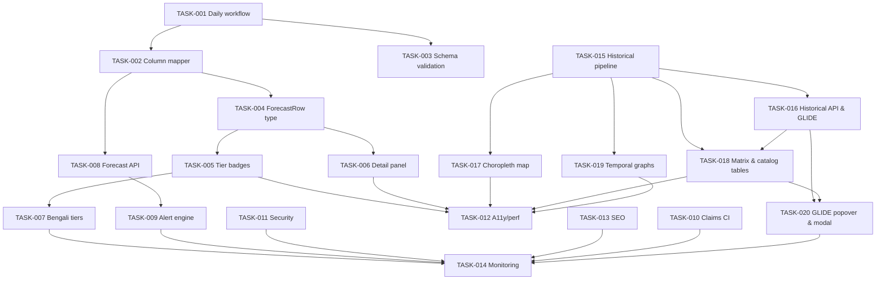

# Task Assignments & Execution Plan — HazardNet v4.1

Version: 4.1 · Updated: 2026-09-29  
Companion documents: `docs/PRD.md` (Product Requirements), `docs/TRD.md` (Technical & Testing Requirements), `PUBLICATION_POLICY.md`

This document defines the actionable work breakdown structure, sub-agent assignments,
dependencies, verification gates, and tracking metrics for HazardNet v4.1. It strictly
reflects the architecture, daily automation pipeline, 2000–2026 historical hazards archive,
multilateral GLIDE integration, and frontend presentation surfaces specified in `PRD.md`
and `TRD.md`.

---

## 1. Master Task Assignment Matrix

| Task ID | Title / Scope | Phase | Type | Assigned Agent | Dependencies | Effort | TRD Gate | Status |
|---|---|---|---|---|---|---|---|---|
| **TASK-001** | Create daily advisory ingest workflow | Phase A | DevOps | devops-agent | None | 8h | Tier 0 (§4.1–§4.6) | Done |
| **TASK-002** | Column mapper (Advisory CSV → ForecastRow) | Phase A | Backend | backend-agent | TASK-001 | 4h | Tier 1 (§5.2) | Done |
| **TASK-003** | Schema validation & staleness guard script | Phase A | Backend | backend-agent | None | 3h | Tier 0 (§4.1, §4.3) | Done |
| **TASK-004** | Extend ForecastRow type with new advisory fields | Phase B | Frontend | frontend-agent | TASK-002 | 4h | Tier 1 (§2.2, §2.3) | Done |
| **TASK-005** | Advisory tier badges and map markers | Phase B | Frontend | frontend-agent | TASK-004 | 8h | Tier 1 (§5.1), Tier 3 (§7.2) | Done |
| **TASK-006** | District detail panel — full field display | Phase B | Frontend | frontend-agent | TASK-004 | 6h | Tier 1 (§5.1), Tier 3 (§7.3) | Done |
| **TASK-007** | Bengali translations for advisory tiers & UI | Phase B | Frontend | frontend-agent | TASK-005 | 3h | Tier 1 (§5.1), Tier 3 (§7.7) | Done |
| **TASK-008** | Forecast API — serve new fields | Phase C | Backend | backend-agent | TASK-002 | 6h | Tier 2 (§6.1) | Done |
| **TASK-009** | Alert state machine + review console endpoints | Phase C | Backend | backend-agent | TASK-008 | 12h | Tier 2 (§6.1), Tier 3 (§7.4) | Done |
| **TASK-010** | Claims registry CI check | Phase C | DevOps | devops-agent | None | 4h | CI Gate (§10) | Done |
| **TASK-015** | Historical data bundling & catalog generator | Phase E | Data/Backend | data-agent | None | 6h | Tier 0 (§4.8) | To Do |
| **TASK-016** | Historical API endpoints & multilateral GLIDE resolver | Phase E | Backend | backend-agent | TASK-015 | 6h | Tier 1 (§5.2), Tier 2 (§6.1, §6.4) | To Do |
| **TASK-017** | Interactive District Risk Choropleth Map | Phase E | Frontend | frontend-agent | TASK-015 | 8h | Tier 1 (§5.1), Tier 3 (§7.10) | To Do |
| **TASK-018** | District Vulnerability Matrix & Catalog Tables | Phase E | Frontend | frontend-agent | TASK-015, TASK-016 | 8h | Tier 1 (§5.1), Tier 3 (§7.9) | To Do |
| **TASK-019** | Temporal trends & multi-hazard interactive graphs | Phase E | Frontend | frontend-agent | TASK-015 | 6h | Tier 1 (§5.1) | To Do |
| **TASK-020** | Event report modal & GLIDE institutional links | Phase E | Frontend | frontend-agent | TASK-016, TASK-018 | 4h | Tier 1 (§5.1), Tier 3 (§7.9) | To Do |
| **TASK-011** | Security P0 checklist & headers hardening | Phase D | DevOps | devops-agent | TASK-009, TASK-016 | 8h | Tier 2 (§9.2) | Done |
| **TASK-012** | Accessibility + performance pass | Phase D | Frontend/QA | qa-agent | TASK-005, TASK-006, TASK-017, TASK-018, TASK-019 | 8h | Tier 3 (§7.5, §9.1, §13) | Done |
| **TASK-013** | SEO foundations + structured data | Phase D | Frontend | frontend-agent | TASK-005, TASK-018 | 6h | Tier 3 (§7.8) | Done |
| **TASK-014** | Operational monitoring & Slack alerts | Phase D | DevOps | devops-agent | TASK-007, TASK-009, TASK-010, TASK-020 | 6h | Tier 0 (§8.3), §11 | Done |

---

## 2. Phase-by-Phase Task Specifications

### Phase A — Daily Pipeline Automation (Days 1–3)

#### TASK-001: Create Daily Advisory Ingest Workflow
- **Type**: DevOps · **Effort**: 8h · **Dependencies**: None
- **Assigned Agent**: `devops-agent`
- **Files**: `.github/workflows/daily_advisory_ingest.yml`
- **Acceptance Criteria**:
  1. Cron trigger set to `30 5 * * *` (05:30 UTC ≈ 11:30 BDT) with `workflow_dispatch` manual fallback.
  2. Fetches `hazardnet_advisories_latest.csv` from Kaggle output (`8-hazardnet-advisory`).
  3. Executes schema validation and staleness guard (`scripts/validate_advisory_csv.mjs`).
  4. Maps advisory columns to backend ForecastRow schema and writes to `backend/data/forecasts/`.
  5. Updates `manifest.json` with `prediction_date`, `row_count`, and `csv_sha256`.
  6. Rebuilds static snapshot (`frontend/public/data/forecasts-latest.json`).
  7. Ingests atomically into Firestore (`scripts/ingest_forecast_csv.mjs --mode=replace`).
  8. Triggers Vercel production deployment and sends Slack notification on success/failure.
- **TRD Verification**: §4.1 through §4.6, §7.1, §8.1.

#### TASK-002: Column Mapper (Advisory CSV → ForecastRow)
- **Type**: Backend · **Effort**: 4h · **Dependencies**: TASK-001
- **Assigned Agent**: `backend-agent`
- **Files**: `backend/utils/advisoryMapper.js`
- **Acceptance Criteria**:
  1. Maps all 22 advisory CSV columns per TRD §2.2.
  2. Resolves `district_id` and `pcode` from district lookup table with alias handling (e.g. Jessore/Jashore, Cumilla/Comilla).
  3. Preserves `advisory_tier` verbatim without re-derivation.
  4. Assigns `final_severity` to `severity_score` as the primary user-facing severity.
  5. Sets `data_source` constant to `"Kaggle_Daily_Advisory"`.
  6. Emits exactly 128 valid records (64 districts × 2 horizons: `7_days`, `15_days`).
- **TRD Verification**: §2.2, §4.2, §5.2.

#### TASK-003: Schema Validation Script
- **Type**: Backend · **Effort**: 3h · **Dependencies**: None
- **Assigned Agent**: `backend-agent`
- **Files**: `scripts/validate_advisory_csv.mjs`
- **Acceptance Criteria**:
  1. Validates that the input CSV has exactly 22 columns with exact header names.
  2. Asserts row count == 128, containing all 64 districts twice (once per horizon).
  3. Enforces staleness guard: generated_at must be within 36 hours of current time; rejects stale data with exit code 1.
  4. Validates enum domains: `advisory_tier` ∈ {`SEVERE`, `WARNING`, `WATCH`, `NORMAL`}; `horizon` ∈ {`7_days`, `15_days`}; `hazard` ∈ 8 defined classes.
  5. Verifies float fields are parseable, finite, and non-NaN.
- **TRD Verification**: §4.1, §4.3.

---

### Phase B — Frontend Field Additions (Days 3–6)

#### TASK-004: Extend ForecastRow Type with New Fields `(Done)`
- **Type**: Frontend · **Effort**: 4h · **Dependencies**: TASK-002
- **Assigned Agent**: `frontend-agent`
- **Files**: `packages/core/src/forecasts.ts`, `frontend/src/lib/forecasts.ts`, `frontend/src/types/index.ts`, `frontend/src/data/bangladeshDistricts.ts`
- **Acceptance Criteria**:
  1. TypeScript `ForecastRow` interface extended with: `advisory_tier`, `physics_override`, `latitude`, `longitude`, `model_severity_raw`, `final_severity`, `prob_top1`, `prob_top2`, `prob_top3`.
  2. Ensures non-breaking backward compatibility with existing static snapshots.
  3. Exports strongly-typed enums for `AdvisoryTier` and `HazardClass`.
- **TRD Verification**: §2.2, §2.3.

#### TASK-005: Advisory Tier Badges and Map Markers `(Done)`
- **Type**: Frontend · **Effort**: 8h · **Dependencies**: TASK-004
- **Assigned Agent**: `frontend-agent`
- **Files**: `frontend/src/components/alerts/AlertLevelBadge.tsx`, `frontend/src/components/map/mapPrimitives.ts`, `frontend/src/components/StatusStrip.tsx`, `frontend/src/components/LiveMapView.tsx`, `frontend/src/components/ForecastDashboard.tsx`
- **Acceptance Criteria**:
  1. Advisory tier badges render with distinct color ramps and accessible icons:
     - `SEVERE` → Crimson Red (#DC2626) with Alert Triangle icon
     - `WARNING` → Vivid Amber (#D97706) with Warning Shield icon
     - `WATCH` → Golden Yellow (#CA8A04) with Eye/Observation icon
     - `NORMAL` → Emerald Green (#16A34A) with Check Circle icon
  2. Map markers on `LiveMapView` reflect active advisory tier for each of the 64 districts.
  3. Status strip shows active counts ("N SEVERE · M WARNING · K WATCH · L NORMAL") matching snapshot totals.
- **TRD Verification**: §5.1, §7.2, §13.

#### TASK-006: District Detail Panel — Full Field Display `(Done)`
- **Type**: Frontend · **Effort**: 6h · **Dependencies**: TASK-004
- **Assigned Agent**: `frontend-agent`
- **Files**: `frontend/src/components/DistrictDetailPanel.tsx`, `frontend/src/components/WeatherPanel.tsx`, `frontend/src/components/ForecastDashboard.tsx`
- **Acceptance Criteria**:
  1. Detail panel displays: District name, Division, Hazard Type, Advisory Tier badge, Target Date, Prediction Date.
  2. Dual-track severity display: Calibrated model severity, physics-track severity, and final fused severity score.
  3. Displays transparency badge ("Physics-grounded") when `physics_override=true`.
  4. Forecasted weather parameters: Max Temp (°C), Min Temp (°C), Precipitation (mm), Wind Speed (km/h).
  5. Confidence breakdown visualizer displaying top-3 hazard probabilities (`prob_top1/2/3`).
  6. Handles low confidence (< 0.40) by displaying the uncertainty advisory notice.
- **TRD Verification**: §5.1, §7.3.

#### TASK-007: Bengali Translations for Advisory Tiers & UI `(Done)`
- **Type**: Frontend · **Effort**: 3h · **Dependencies**: TASK-005
- **Assigned Agent**: `frontend-agent`
- **Files**: `frontend/src/locales/bn.json`, `frontend/src/locales/en.json`, `frontend/src/components/LanguageToggle.tsx`, `frontend/src/lib/i18n.ts`
- **Acceptance Criteria**:
  1. Complete translation parity for tiers: SEVERE → গুরুতর, WARNING → সতর্কবার্তা, WATCH → পর্যবেক্ষণ, NORMAL → স্বাভাবিক.
  2. Disaster terminology matches the reviewed agrometeorological glossary.
  3. Dynamic language switcher toggles between Bengali and English across all UI components without untranslated tokens.
- **TRD Verification**: §5.1, §7.7.

---

### Phase C — Backend & API (Days 4–8, parallel)

#### TASK-008: Forecast API — Serve New Fields `(Done)`
- **Type**: Backend · **Effort**: 6h · **Dependencies**: TASK-002
- **Assigned Agent**: `backend-agent`
- **Files**: `backend/routes/forecasts.js`, `api/forecasts.js`
- **Acceptance Criteria**:
  1. `GET /api/v1/forecasts/bulk?horizon=7_days` returns array with all new fields (`advisory_tier`, `physics_override`, `latitude`, `longitude`, `prob_top1/2/3`, `final_severity`).
  2. `GET /api/v1/forecasts/metadata` returns `prediction_date`, `ingestion_timestamp`, `data_source`, and `row_count`.
  3. Response payload p95 latency < 300ms under 500 concurrent public readers.
- **TRD Verification**: §6.1, §9.1.

#### TASK-009: Alert State Machine + Review Console Endpoints `(Done)`
- **Type**: Backend · **Effort**: 12h · **Dependencies**: TASK-008
- **Assigned Agent**: `backend-agent`
- **Files**: `backend/routes/alerts.js`, `backend/services/alertEngine.js`
- **Acceptance Criteria**:
  1. Implements state machine: `DRAFT → PENDING_REVIEW → PUBLISHED → UPDATED → EXPIRED/ALL_CLEAR` (+ `REJECTED`).
  2. `POST /v1/alerts/{id}/review` strictly requires `reviewer` role; unauthorized requests return 403 `REVIEW_ROLE_REQUIRED`.
  3. Optimistic locking prevents race conditions between concurrent reviewers.
  4. Every state transition creates an immutable audit trail record.
- **TRD Verification**: §6.1, §7.4, §9.2.

#### TASK-010: Claims Registry CI Check `(Done)`
- **Type**: DevOps · **Effort**: 4h · **Dependencies**: None
- **Assigned Agent**: `devops-agent`
- **Files**: `CLAIMS.md`, `scripts/verify_claims.mjs`, `.github/workflows/ci.yml`
- **Acceptance Criteria**:
  1. Maps every public headline metric to its stated methodological limitations.
  2. CI fails build if any numeric performance or verification claim appears in public files without a matching registry entry.
- **TRD Verification**: §10.

---

### Phase E — Historical Hazards & Multilateral GLIDE Integration (Days 6–10, parallel)

#### TASK-015: Historical Data Bundling & Catalog Generator `(Done)`
- **Type**: Data/Backend · **Effort**: 6h · **Dependencies**: None
- **Assigned Agent**: `data-agent`
- **Files**: `scripts/build_historical_catalog.mjs`, `frontend/public/data/historical/`
- **Acceptance Criteria**:
  1. Ingests all 5 analytical CSVs from `kaggle-notebooks/1-HazardNet_BGD_climatic_hazards/1-HazardNet_BGD_climatic_hazards`.
  2. Asserts exact 3,062 rows in `BGD_climatic_hazards_dataset_2000_2026.csv` and 64 districts in `hazardnet_district_vulnerability_index.csv`.
  3. Verifies GLIDE ID formats (`^[A-Z]{2}-\d{4}-\d{6}-BGD$`).
  4. Emits optimized static JSON artifacts:
     - `districts-vulnerability.json` (64 districts ranked by vulnerability score)
     - `temporal-trends.json` (26-year yearly frequencies 2000–2026)
     - `hazard-distribution.json` (proportions across 8 classes)
     - `events-master.json` (70 master GLIDE disaster events with narrative)
     - `hazard-catalog-index.json` (compact search index for 3,062 events)
- **TRD Verification**: §2.4, §4.8.

#### TASK-016: Historical API Endpoints & Multilateral GLIDE Resolver `(Done)`
- **Type**: Backend · **Effort**: 6h · **Dependencies**: TASK-015
- **Assigned Agent**: `backend-agent`
- **Files**: `backend/routes/historical.js`, `backend/utils/glideResolver.js`, `api/historical.js`
- **Acceptance Criteria**:
  1. Implements `generateGlideLinks(glideId)` utility resolving URLs for ReliefWeb, FAO GIEWS, WHO Emergency, ADRC, and IFRC GO.
  2. Exposes endpoints:
     - `GET /api/v1/historical/hazards` (supports query params: district, division, hazard_type, year, glide, page, limit)
     - `GET /api/v1/historical/vulnerability` (returns 64 districts sorted by rank)
     - `GET /api/v1/historical/trends` (returns 2000–2026 annual trend and multi-hazard breakdown)
     - `GET /api/v1/historical/events/:id` (returns disaster narrative and multilateral links)
     - `GET /api/v1/historical/summary` (returns headline counts: 3,324 raw, 3,062 clean, 64 districts, 8 divisions)
- **TRD Verification**: §2.5, §5.2, §6.1, §6.4.

#### TASK-017: Interactive District Risk Choropleth Map `(Done)`
- **Type**: Frontend · **Effort**: 8h · **Dependencies**: TASK-015
- **Assigned Agent**: `frontend-agent`
- **Files**: `frontend/src/components/DistrictRiskMap.tsx`, `frontend/src/lib/geo.ts`
- **Acceptance Criteria**:
  1. Renders 64 Bangladesh district boundaries using Leaflet/MapLibre.
  2. Dynamic color ramp shaded by `Vulnerability_Score` (0.0 = low risk, 1.0 = extreme risk).
  3. Interactive hover tooltip shows: District name, Division, Vulnerability Score, and Dominant Hazard Threat.
  4. Clicking a district triggers callback opening historical drawer with 26-year disaster metrics.
- **TRD Verification**: §5.1, §7.10.

#### TASK-018: District Vulnerability Matrix & Historical Catalog Tables `(Done)`
- **Type**: Frontend · **Effort**: 8h · **Dependencies**: TASK-015, TASK-016
- **Assigned Agent**: `frontend-agent`
- **Files**: `frontend/src/components/DistrictVulnerabilityTable.tsx`, `frontend/src/components/HistoricalHazardCatalog.tsx`
- **Acceptance Criteria**:
  1. `<DistrictVulnerabilityTable />`: 64 rows, sortable by Rank, District, Vulnerability Score, Total Events, and Unique Hazard count; filterable by administrative division.
  2. `<HistoricalHazardCatalog />`: Instant client-side text search over 3,062 records; filters for District, Division, Hazard Type, and Year Range (2000–2026).
  3. GLIDE IDs rendered as clickable pill badges opening `<GlideResourcePopover>`.
  4. Includes CSV/JSON export action.
- **TRD Verification**: §5.1, §7.9.

#### TASK-019: Temporal Trends & Multi-Hazard Interactive Graphs `(Done)`
- **Type**: Frontend · **Effort**: 6h · **Dependencies**: TASK-015
- **Assigned Agent**: `frontend-agent`
- **Files**: `frontend/src/components/TemporalTrendChart.tsx`, `frontend/src/components/MultiHazardDistributionChart.tsx`
- **Acceptance Criteria**:
  1. `<TemporalTrendChart />`: Interactive Recharts bar/line chart rendering annual frequencies (2000–2026); highlights landmark disaster years (2007 Cyclone Sidr, 2017 Floods, 2024 Cyclone Remal).
  2. `<MultiHazardDistributionChart />`: Proportional donut/radar chart displaying 8 hazard classes (Flood 29.1%, Cyclone 23.2%, Storm 16.8%, Flash Flood 10.9%, Cold Wave 10.5%, Fire 2.1%, Drought 2.1%, Heat Wave 1.2%).
  3. Toggle between national aggregate and division-specific breakdowns.
- **TRD Verification**: §5.1.

#### TASK-020: Event Situation Report Modal & GLIDE Institutional Links `(Done)`
- **Type**: Frontend · **Effort**: 4h · **Dependencies**: TASK-016, TASK-018
- **Assigned Agent**: `frontend-agent`
- **Files**: `frontend/src/components/EventReportModal.tsx`, `frontend/src/components/GlideResourcePopover.tsx`
- **Acceptance Criteria**:
  1. `<GlideResourcePopover />`: Floating popover presenting direct links to ReliefWeb, FAO GIEWS, WHO Emergency, ADRC, and IFRC GO with `rel="noopener noreferrer"`.
  2. `<EventReportModal />`: Modal dialog presenting full disaster situation narrative, validated affected counts, GEE observation temporal window (`GEE_Start` to `GEE_End`), and affected district footprint.
- **TRD Verification**: §5.1, §6.4, §7.9.

---

### Phase D — Hardening & Launch (Days 10–14)

#### TASK-011: Security P0 Checklist & Headers Hardening `(Done)`
- **Type**: DevOps · **Effort**: 8h · **Dependencies**: TASK-009, TASK-016
- **Assigned Agent**: `devops-agent`
- **Files**: `backend/security/csp.js`, `backend/middleware/securityHeaders.js`, `docs/SECURITY.md`
- **Acceptance Criteria**:
  1. Strict CSP without `unsafe-inline`; HSTS with `includeSubDomains; preload`.
  2. Outbound GLIDE link security: external links strictly validated, sanitized, and decorated with `rel="noopener noreferrer"`.
  3. Rate limiting enforced on all public and API endpoints.
  4. RFC 9116 `security.txt` deployed at `/.well-known/security.txt`.
  5. Secret scanning gate clean; zero exposed keys.
- **TRD Verification**: §9.2.

#### TASK-012: Accessibility + Performance Pass `(Done)`
- **Type**: Frontend/QA · **Effort**: 8h · **Dependencies**: TASK-005, TASK-006, TASK-017, TASK-018, TASK-019
- **Assigned Agent**: `qa-agent`
- **Files**: `frontend/src/`, `playwright.config.ts`
- **Acceptance Criteria**:
  1. Lighthouse accessibility score ≥ 95 on all public routes (`/`, `/archive`, `/district/[id]`, `/validation`).
  2. WCAG 2.2 AA compliant contrast on all advisory tier badges and vulnerability map markers.
  3. Bangladesh 3G profile performance: LCP < 2.5s; initial transfer < 500KB (excluding map tiles); lite mode < 50KB.
  4. Full keyboard navigation and screen-reader accessibility for tables, modals, and choropleth polygons.
- **TRD Verification**: §7.5, §9.1, §13.

#### TASK-013: SEO Foundations + Structured Data `(Done)`
- **Type**: Frontend · **Effort**: 6h · **Dependencies**: TASK-005, TASK-018
- **Assigned Agent**: `frontend-agent`
- **Files**: `frontend/public/sitemap.xml`, `frontend/public/robots.txt`, `frontend/src/components/SEOHead.tsx`
- **Acceptance Criteria**:
  1. Dynamic `sitemap.xml` generates permalinks for all 64 districts and published alert archives.
  2. JSON-LD structured data validated for `Dataset`, `GovernmentOrganization`, and `FAQPage`.
  3. Open Graph and Twitter card meta tags correctly configured for Bengali and English.
- **TRD Verification**: §7.8.

#### TASK-014: Operational Monitoring & Slack Alerts `(Done)`
- **Type**: DevOps · **Effort**: 6h · **Dependencies**: TASK-007, TASK-009, TASK-010, TASK-020
- **Assigned Agent**: `devops-agent`
- **Files**: `scripts/notify_ops.mjs`, `.github/workflows/daily_advisory_ingest.yml`
- **Acceptance Criteria**:
  1. Pipeline success webhook dispatches summary (row count, tier distribution, ingestion duration) to Slack `#hazardnet-ops`.
  2. Pipeline failure or staleness > 36h triggers incident notification (Slack + email).
  3. Live freshness badge on website updates status based on `generated_at`.
- **TRD Verification**: §8.3, §11.

---

## 3. Dependency Graph

---

## 4. Critical Path & Parallel Work Streams

### Work Stream 1: Daily Pipeline Automation & Frontend Surfacing (Lead: `backend-agent` & `frontend-agent`)
`TASK-001 (8h) → TASK-002 (4h) → TASK-004 (4h) → TASK-005 (8h) → TASK-012 (8h) → TASK-014 (6h) = ~38h`

### Work Stream 2: Historical Hazards & GLIDE Multilateral Integration (Lead: `data-agent` & `frontend-agent`)
`TASK-015 (6h) → TASK-016 (6h) → TASK-018 (8h) → TASK-020 (4h) → TASK-012 (8h) = ~32h`

### Work Stream 3: Governance, RBAC & Hardening (Lead: `backend-agent` & `devops-agent`)
`TASK-008 (6h) → TASK-009 (12h) → TASK-010 (4h) → TASK-011 (8h) = ~30h`

**Total Estimated Engineer Hours**: ~124h (~12–14 working days for 1 engineer; ~4–5 calendar days with parallelized sub-agent execution).

---

## 5. Definition of Done Checklist

- [x] Unattended daily pipeline execution verified (Kaggle → GitHub Actions → Vercel)
- [x] 128 forecast records published daily with correct advisory tiers and weather fields
- [x] 26-year historical disaster catalog (3,062 events, 64 districts) bundled into static client JSON files
- [x] District vulnerability index calculated, ranked, and mapped across all 64 districts and 8 divisions
- [x] All 70 master disaster events carry verified GLIDE identifiers with functioning links to ReliefWeb, FAO GIEWS, WHO Emergency, and ADRC
- [x] Interactive choropleth risk map renders 64 districts with dynamic vulnerability color ramp, tooltips, and drawer
- [x] Historical hazard catalog table offers instant text search, division/hazard/year filters, and CSV/JSON export
- [x] Temporal trends interactive graph renders annual frequencies (2000–2026) and multi-hazard distribution charts
- [x] Event detail modal renders narrative, affected counts, GEE observation window, and branded external resource badges
- [x] Human-in-the-loop review enforcement verified (403 returned on unauthorized publish attempts)
- [x] Bengali and English language parity validated across all strings, tier names, and hazard terminology
- [x] Lighthouse accessibility score ≥ 95 and performance budgets met (LCP < 2.5s on Bangladesh 3G)
- [x] Security P0 checklist clean; CSP, HSTS, rate limits, and `security.txt` verified
- [x] Claims registry CI gate passing (no untracked metrics)
